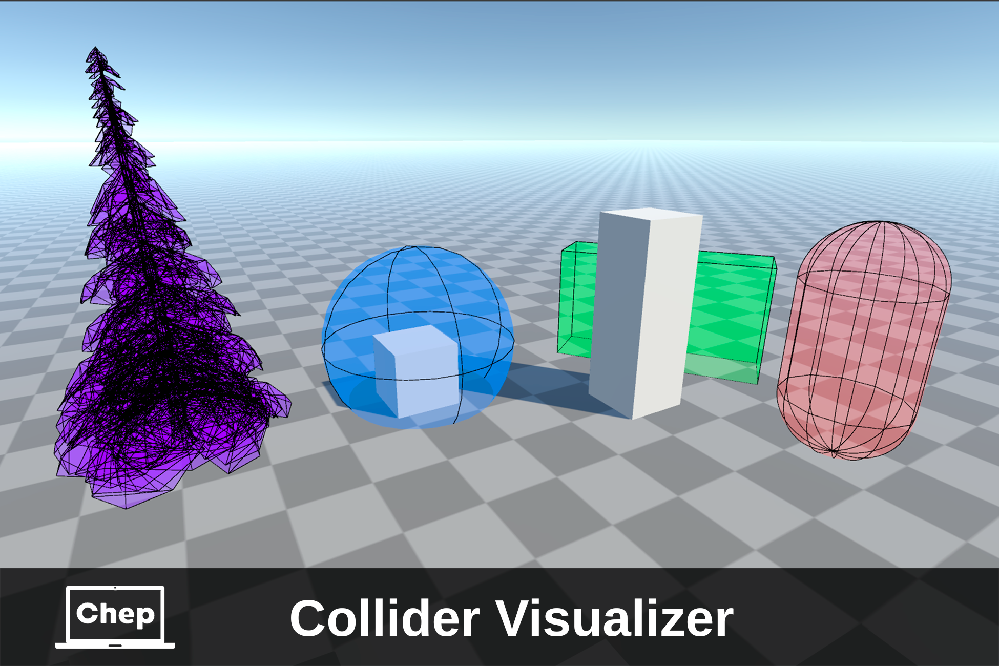

# Collider Visualizer

**Available on Asset Store:** https://assetstore.unity.com/packages/tools/utilities/collider-visualizer-318546

Collider Visualizer is a lightweight tool to display primitive colliders and MeshColliders both in the Unity Editor and in builds. Perfect for debugging and polishing physics.

Collider Visualizer lets you easily visualize primitive colliders without needing any mesh components.
MeshColliders are rendered directly using their assigned meshes.

Customize the look by toggling solid fills and wireframe outlines for full control over the visual style.

#### Supported Collider Types:
- BoxCollider
- SphereCollider
- CapsuleCollider
- MeshCollider

Works seamlessly in both the Unity Editor and built applications — ideal for debugging, development, and polishing physics interactions!

### Render pipelines:
- Built-in ✔️
- URP ✔️
- HDRP ❌

## INSTALLATION
There are 3 ways to install this plugin:

- import [ColliderVisualizer.unitypackage](https://github.com/dimdimich123/ColliderVisualizer/releases) via *Assets-Import Package*
- clone/download this repository and move the **ColliderVisualizer** folder to your Unity project's **Assets** folder
- import it from [Asset Store](https://assetstore.unity.com/packages/tools/utilities/collider-visualizer-318546)

## User Guide:
You can find the user guide in the repository under the path [Assets\ColliderVisualizer\ColliderVisualizerManual.pdf](Assets/ColliderVisualizer/ColliderVisualizerManual.pdf) or in the Unity package files under *ColliderVisualizer\ColliderVisualizerManual*.

